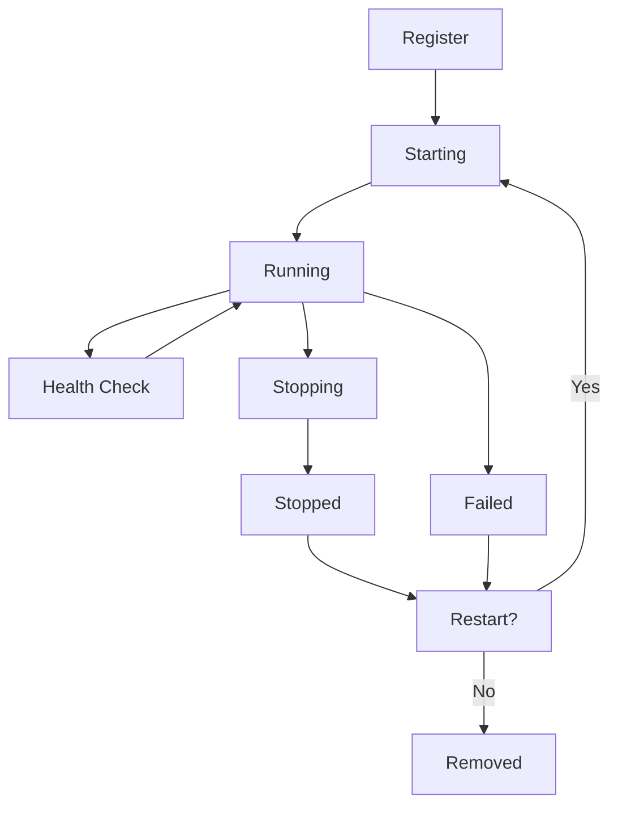

<div align="center">
    
    <h1>
        <strong>Process Daemon</strong>
        <sup><br><sub>RUST DAEMON FRAMEWORK</sub></sup>
    </h1>
        <a href="https://crates.io/crates/proc-daemon" alt="Error-Protocol on Crates.io"></a>
        <span>&nbsp;</span>
        <a href="https://crates.io/crates/proc-daemon" alt="Download proc-daemon"></a>
        <span>&nbsp;</span>
        <a href="./LICENSE" title="License"></a>
        <span>&nbsp;</span>
        <a href="https://docs.rs/proc-daemon" title="proc-daemon Documentation"></a>
        <span>&nbsp;</span>
        <a href="https://github.com/jamesgober/proc-daemon/actions"></a>
</div>
<br>
<p>
    A foundational framework for building high-performance, resilient daemon services in Rust. Designed for enterprise applications requiring nanosecond-level performance, bulletproof reliability, and extreme concurrency.
</p>

## Features

### Core Capabilities
- **Zero-Copy Architecture**: Minimal allocations with memory pooling for maximum performance
- **Runtime Agnostic**: First-class support for both Tokio and async-std via feature flags
- **Cross-Platform**: Native support for Linux, macOS, and Windows with platform-specific optimizations
- **Graceful Shutdown**: Coordinated shutdown with configurable timeouts and subsystem awareness
- **Signal Handling**: Robust cross-platform signal management (SIGTERM, SIGINT, SIGQUIT, SIGHUP, Windows console events)

### Advanced Features
- **Subsystem Management**: Concurrent subsystem lifecycle management with health checks and auto-restart
- **Configuration Hot-Reload**: Dynamic configuration updates without service interruption
- **Structured Logging**: High-performance tracing with JSON support and log rotation
- **Metrics Collection**: Built-in performance monitoring and resource tracking
- **Memory Safety**: Safe Rust by default (`#![deny(unsafe_code)]`); Windows monitoring uses guarded `unsafe` when the `windows-monitoring` feature is enabled

### Enterprise Ready
- **High Concurrency**: Built for 100,000+ concurrent operations
- **Resource Management**: Intelligent memory pooling and NUMA awareness
- **Health Monitoring**: Comprehensive subsystem health checks and diagnostics
- **Production Tested**: Battle-tested patterns from high-scale deployments

<br>
<hr>
<br>

## Installation

Add this to your `Cargo.toml`:

```toml
[dependencies]
proc-daemon = "1.0.0-rc.2"

# Optional features
proc-daemon = { version = "1.0.0-rc.2", features = ["full"] }
```

### Feature Flags

| Feature | Description | Default |
|---------|-------------|---------|
| `tokio` | Tokio runtime support | ✅ |
| `async-std` | async-std runtime support | ❌ |
| `metrics` | Performance metrics collection | ❌ |
| `console` | Enhanced console output | ❌ |
| `json-logs` | JSON structured logging | ❌ |
| `config-watch` | Configuration hot-reloading | ❌ |
| `mmap-config` | Memory-mapped config file loading (TOML fast-path, safe fallback) | ❌ |
| `mimalloc` | Use mimalloc as global allocator | ❌ |
| `high-res-timing` | High-resolution timing via `quanta` | ❌ |
| `scheduler-hints` | Enable scheduler tuning hooks (no-op by default) | ❌ |
| `scheduler-hints-unix` | Best-effort Unix niceness adjustment (uses `renice`; no-op without privileges) | ❌ |
| `lockfree-coordination` | Lock-free coordination/events via crossbeam-channel | ❌ |
| `profiling` | Optional CPU profiling via `pprof` | ❌ |
| `heap-profiling` | Optional heap profiling via `dhat` | ❌ |
| `full` | All features enabled | ❌ |

Note: `async-std` is discontinued upstream; support here is best-effort and intended for existing users.

## Quick Start

### Simple Daemon

```rust
use proc_daemon::{Daemon, Config};
use std::time::Duration;

async fn my_service(mut shutdown: proc_daemon::ShutdownHandle) -> proc_daemon::Result<()> {
    let mut counter = 0;
    
    loop {
        tokio::select! {
            _ = shutdown.cancelled() => {
                tracing::info!("Service shutting down gracefully after {} iterations", counter);
                break;
            }
            _ = tokio::time::sleep(Duration::from_secs(1)) => {
                counter += 1;
                tracing::info!("Service running: iteration {}", counter);
            }
        }
    }
    
    Ok(())
}

#[tokio::main]
async fn main() -> proc_daemon::Result<()> {
    let config = Config::new()?;
    
    Daemon::builder(config)
        .with_task("my_service", my_service)
        .run()
        .await
}
```

### High-Resolution Timing (optional)

Enable the `high-res-timing` feature to access a fast, monotonic clock backed by `quanta`:

```toml
[dependencies]
proc-daemon = { version = "1.0.0-rc.2", features = ["high-res-timing"] }
```

```rust
#[cfg(feature = "high-res-timing")]
{
    let t0 = proc_daemon::timing::now();
    // ... work ...
    let t1 = proc_daemon::timing::now();
    let dt = t1.duration_since(t0);
    println!("elapsed: {:?}", dt);
}
```

### Mimalloc Global Allocator (optional)

Enable the `mimalloc` feature to switch the global allocator for potential performance wins in allocation-heavy workloads:

```toml
[dependencies]
proc-daemon = { version = "1.0.0-rc.2", features = ["mimalloc"] }
```

No code changes are required—`proc-daemon` sets the global allocator when the feature is enabled.

### Lock-free Coordination (optional)

Enable the `lockfree-coordination` feature to use a lock-free MPMC channel for coordination. This exposes a small channel facade and optional subsystem events for state changes.

```toml
[dependencies]
proc-daemon = { version = "1.0.0-rc.2", features = ["lockfree-coordination"] }
```

APIs:

- `proc_daemon::coord::chan::{unbounded, try_recv}` — Uniform API over `crossbeam-channel` (enabled) or `std::sync::mpsc` (fallback).
- `SubsystemManager::enable_events()` and `SubsystemManager::try_next_event()` — non-blocking event polling.
- `SubsystemManager::subscribe_events()` — get a `Receiver<SubsystemEvent>` to poll from another task when events are enabled.

Event type:

```text
SubsystemEvent::StateChanged { id, name, state, at }
```

### Multi-Subsystem Daemon

```rust
use proc_daemon::{Daemon, Config, Subsystem, ShutdownHandle, RestartPolicy};
use std::pin::Pin;
use std::future::Future;
use std::time::Duration;

// Define a custom subsystem
struct HttpServer {
    port: u16,
}

impl Subsystem for HttpServer {
    fn run(&self, mut shutdown: ShutdownHandle) -> Pin<Box<dyn Future<Output = proc_daemon::Result<()>> + Send>> {
        let port = self.port;
        Box::pin(async move {
            tracing::info!("HTTP server starting on port {}", port);
            
            loop {
                tokio::select! {
                    _ = shutdown.cancelled() => {
                        tracing::info!("HTTP server shutting down");
                        break;
                    }
                    _ = tokio::time::sleep(Duration::from_millis(100)) => {
                        // Handle HTTP requests here
                    }
                }
            }
            
            Ok(())
        })
    }

    fn name(&self) -> &str {
        "http_server"
    }

    fn restart_policy(&self) -> RestartPolicy {
        RestartPolicy::ExponentialBackoff {
            initial_delay: Duration::from_secs(1),
            max_delay: Duration::from_secs(60),
            max_attempts: 5,
        }
    }
}

async fn background_worker(mut shutdown: ShutdownHandle) -> proc_daemon::Result<()> {
    while !shutdown.is_shutdown() {
        tokio::select! {
            _ = shutdown.cancelled() => break,
            _ = tokio::time::sleep(Duration::from_secs(5)) => {
                tracing::info!("Background work completed");
            }
        }
    }
    Ok(())
}

#[tokio::main]
async fn main() -> proc_daemon::Result<()> {
    let config = Config::builder()
        .name("multi-subsystem-daemon")
        .shutdown_timeout(Duration::from_secs(30))
        .worker_threads(4)
        .build()?;

    Daemon::builder(config)
        .with_subsystem(HttpServer { port: 8080 })
        .with_task("background_worker", background_worker)
        .run()
        .await
}
```

## Configuration

### Programmatic Configuration

```rust
use proc_daemon::{Config, LogLevel};
use std::time::Duration;

let config = Config::builder()
    .name("my-daemon")
    .log_level(LogLevel::Info)
    .json_logging(true)
    .shutdown_timeout(Duration::from_secs(30))
    .worker_threads(8)
    .enable_metrics(true)
    .hot_reload(true)
    .build()?;
```

### File Configuration (TOML)

Create a `daemon.toml` file:

```toml
name = "my-production-daemon"

[logging]
level = "info"
json = false
color = true
file = "/var/log/my-daemon.log"

[shutdown]
timeout_ms = 30000
force_timeout_ms = 45000
kill_timeout_ms = 60000

[performance]
worker_threads = 0  # auto-detect
thread_pinning = false
memory_pool_size = 1048576
numa_aware = false
lock_free = true

[monitoring]
enable_metrics = true
metrics_interval_ms = 1000
health_checks = true
```

Load the configuration:

```rust
let config = Config::load_from_file("daemon.toml")?;
```

### Environment Variables

All configuration options can be overridden with environment variables using the `DAEMON_` prefix:

```bash
export DAEMON_NAME="env-daemon"
export DAEMON_LOGGING_LEVEL="debug"
export DAEMON_SHUTDOWN_TIMEOUT_MS="60000"
export DAEMON_PERFORMANCE_WORKER_THREADS="16"
```

## Advanced Usage

### Custom Subsystems with Health Checks

```rust
struct DatabasePool {
    connections: Arc<AtomicUsize>,
}

impl Subsystem for DatabasePool {
    fn run(&self, mut shutdown: ShutdownHandle) -> Pin<Box<dyn Future<Output = proc_daemon::Result<()>> + Send>> {
        let connections = Arc::clone(&self.connections);
        Box::pin(async move {
            // Database pool management logic
            Ok(())
        })
    }

    fn name(&self) -> &str {
        "database_pool"
    }

    fn health_check(&self) -> Option<Box<dyn Fn() -> bool + Send + Sync>> {
        let connections = Arc::clone(&self.connections);
        Some(Box::new(move || {
            connections.load(Ordering::Acquire) > 0
        }))
    }
}
```

### Metrics Collection

```rust
#[cfg(feature = "metrics")]
use proc_daemon::metrics::MetricsCollector;

let collector = MetricsCollector::new();

// Increment counters
collector.increment_counter("requests_total", 1);

// Set gauge values
collector.set_gauge("active_connections", 42);

// Record timing histograms
collector.record_histogram("request_duration", Duration::from_millis(150));

// Get metrics snapshot
let snapshot = collector.get_metrics();
println!("Uptime: {:?}", snapshot.uptime);
```

### Signal Handling Configuration

```rust
use proc_daemon::signal::SignalConfig;

let signal_config = SignalConfig::new()
    .with_sighup()  // Enable SIGHUP handling
    .without_sigint()  // Disable SIGINT
    .with_custom_handler(12, "Custom signal");

Daemon::builder(config)
    .with_signal_config(signal_config)
    .run()
    .await
```

## Architecture

### Zero-Copy Design

proc-daemon is built around zero-copy principles:

- **Arc-based sharing**: Configuration and state shared via `Arc` to avoid cloning
- **Lock-free coordination**: Uses atomic operations and lock-free data structures
- **Memory pooling**: Pre-allocated memory pools for high-frequency operations
- **Efficient serialization**: Direct memory mapping for configuration loading

### Subsystem Lifecycle



### Shutdown Coordination

proc-daemon implements a sophisticated shutdown coordination system:

1. **Signal Reception**: Cross-platform signal handling
2. **Graceful Notification**: All subsystems notified simultaneously
3. **Coordinated Shutdown**: Subsystems shut down in dependency order
4. **Timeout Management**: Configurable graceful and force timeouts
5. **Resource Cleanup**: Automatic cleanup of resources and handles

## Testing

Run the test suite:

```bash
# Run all tests
cargo test

# Run tests with all features
cargo test --all-features

# Run integration tests
cargo test --test integration

# Run benchmarks
cargo bench
```


<hr>
<br>


### Hot-Reload (optional)

Enable `config-watch` to live-reload `daemon.toml` at runtime (optionally combine with `mmap-config` for fast TOML loading). The daemon maintains a live snapshot accessible via `Daemon::config_snapshot()`.

Run the example:

```bash
cargo run --example hot_reload --features "tokio config-watch toml mmap-config"
```

Notes:

- Place `daemon.toml` in the working directory.
- The watcher starts automatically when `Config.hot_reload = true`.

<hr>
<br>

## PERFORMANCE
proc-daemon is designed for extreme performance:


### Running Benchmarks
```bash
cargo bench
```

### Typical performance:
- **Daemon Creation**: ~1-5μs
- **Subsystem Registration**: ~500ns per subsystem
- **Shutdown Coordination**: ~10-50μs for 100 subsystems
- **Signal Handling**: ~100ns latency
- **Metrics Collection**: ~10ns per operation


### Memory Usage
- **Base daemon**: ~1-2MB
- **Per subsystem**: ~4-8KB
- **Configuration**: ~1-4KB
- **Signal handling**: ~512B
 
</br>
</br>

**🔗 See [`PERFORMANCE.md`](./docs/PERFORMANCE.md) for up-to-date benchmarks, metrics, and version-over-version improvements.**


<br>
<hr>
<br>

## Security
- **Memory Safety**: Safe Rust by default; Windows monitoring uses guarded `unsafe` when the `windows-monitoring` feature is enabled
- **Signal Safety**: Async signal handling prevents race conditions  
- **Resource Limits**: Configurable limits prevent resource exhaustion
- **Graceful Degradation**: Continues operating even when subsystems fail

### Development Setup

```bash
git clone https://github.com/jamesgober/proc-daemon.git
cd proc-daemon
cargo build --all-features
cargo test --all-features
```


<!-- API REFERENCE
############################################# -->
<hr>
<br>
<h3>Documentation:</h3>
<ul>
    <li><a href="./docs/API.md"><b>API Reference</b></a> Complete documentation and examples.</li>
    <li><a href="./docs/PRINCIPLES.md"><b>Code Principles</b></a> guidelines for contribution &amp; development.</li>
</ul>

<br>
<hr>


<!-- API REFERENCE
############################################# -->

### Acknowledgments
- Inspired by production daemon patterns from high-scale deployments
- Built on the excellent Rust async ecosystem (Tokio; async-std legacy support)
- Configuration management powered by [Figment](https://github.com/SergioBenitez/Figment)
- Logging via the [tracing](https://github.com/tokio-rs/tracing) ecosystem

<hr>
<br>
<br>

<h2 align="center">
    DEVELOPMENT &amp; CONTRIBUTION
</h2>

We welcome contributions! Please see [CONTRIBUTING.md](CONTRIBUTING.md) for guidelines.

<br><br><br>

<div align="center">
    
    <br><sup><b>Built with Rust.</b></sup>
</div>

<br>
<br>


<!-- LICENSE
############################################# -->
<div id="license">
    <h2>⚖️ License</h2>
    <p>Licensed under the <b>Apache License</b>, version 2.0 (the <b>"License"</b>); you may not use this software, including, but not limited to the source code, media files, ideas, techniques, or any other associated property or concept belonging to, associated with, or otherwise packaged with this software except in compliance with the <b>License</b>.</p>
    <p>You may obtain a copy of the <b>License</b> at: <a href="http://www.apache.org/licenses/LICENSE-2.0" title="Apache-2.0 License" target="_blank">http://www.apache.org/licenses/LICENSE-2.0</a>.</p>
    <p>Unless required by applicable law or agreed to in writing, software distributed under the <b>License</b> is distributed on an "<b>AS IS" BASIS, WITHOUT WARRANTIES OR CONDITIONS OF ANY KIND</b>, either express or implied.</p>
    <p>See the <a href="./LICENSE" title="Software License file">LICENSE</a> file included with this project for the specific language governing permissions and limitations under the <b>License</b>.</p>
</div>

<br>

<!-- COPYRIGHT
############################################# -->
<div align="center">
  <h2></h2>
  <sup>COPYRIGHT <small>&copy;</small> 2025 <strong>JAMES GOBER.</strong></sup>
</div>